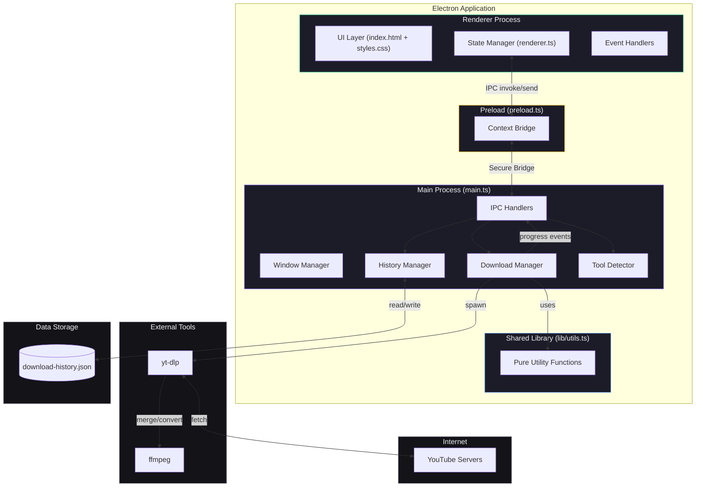
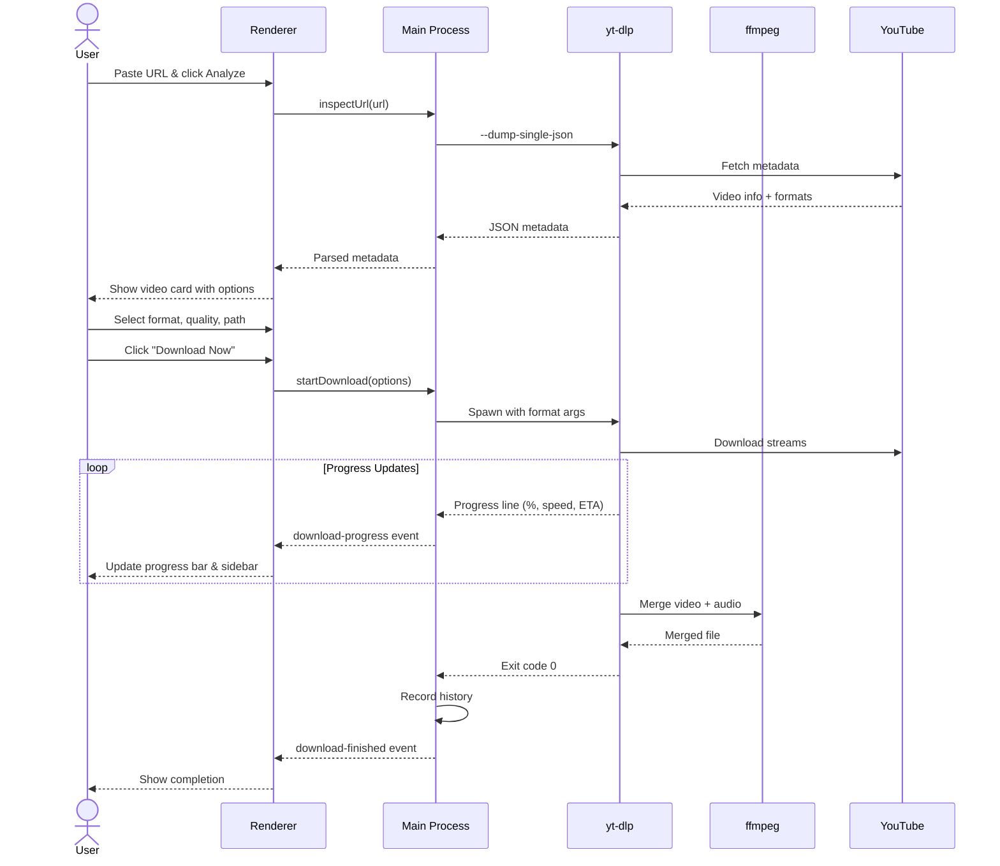
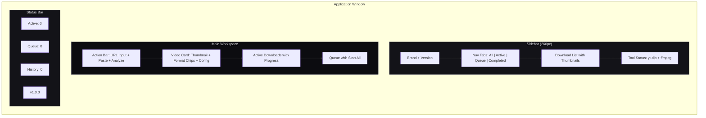
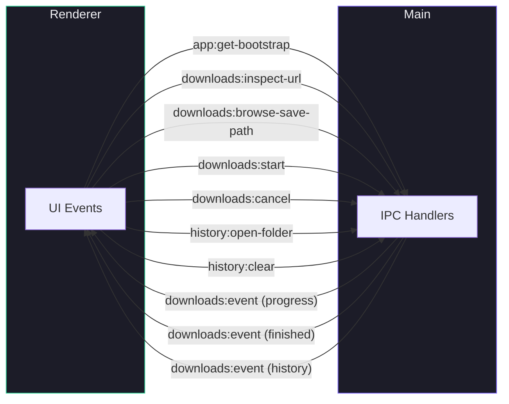

# YouTube Video Downloader

A professional, cross-platform desktop application for downloading YouTube videos and audio. Built with **Electron** and **yt-dlp**, featuring a competitor-level dark UI inspired by FDM, IDM, and 4K Video Downloader — with real-time progress tracking, download queue management, and persistent history.

[](https://github.com/rishat5081/youtube-video-downloader/actions/workflows/ci.yml)
[](https://github.com/rishat5081/youtube-video-downloader/actions/workflows/code-quality.yml)


---

## Features

| Category            | Features                                                                                       |
| ------------------- | ---------------------------------------------------------------------------------------------- |
| **Download Engine** | Multi-format (MP4, WEBM, MP3, WAV), quality selection, real-time progress with speed & ETA     |
| **Queue System**    | Batch queue, start all, individual start/remove, concurrent downloads                          |
| **Smart UI**        | Three-zone layout, format toggle chips, clipboard paste, sidebar navigation with status tabs   |
| **History**         | Persistent across sessions, filterable by status (All/Active/Queue/Completed), max 200 entries |
| **Automation**      | Environment variable support for scripting and CI/CD pipelines                                 |
| **Security**        | Context isolation, no node integration, XSS-escaped output, local files only                   |

## UI Design

The interface follows a **three-zone layout** inspired by professional download managers:

- **Sidebar** — Navigation tabs (All / Active / Queue / Completed) with live counts, download list with thumbnails and status indicators, tool status pills
- **Action Bar** — URL input with clipboard paste button and Analyze trigger
- **Main Content** — Video preview card with format chips, quality selector, download/queue actions, active download progress cards

### Color System

| Element      | Color                             | Usage                                                 |
| ------------ | --------------------------------- | ----------------------------------------------------- |
| **Accent**   | `#7c65f6` (Purple)                | Buttons, progress bars, active states, brand identity |
| **Base**     | `#0c0c10`                         | Background                                            |
| **Surface**  | `#131318`                         | Cards, sidebar, panels                                |
| **Elevated** | `#1a1a22`                         | Inputs, chips, hover states                           |
| **Text**     | `#f0f0f4` / `#9d9db0` / `#5c5c70` | Primary / Secondary / Muted                           |

## Prerequisites

| Tool        | Version | Purpose                | Install                                               |
| ----------- | ------- | ---------------------- | ----------------------------------------------------- |
| **Node.js** | 20+     | Runtime                | [nodejs.org](https://nodejs.org)                      |
| **pnpm**    | 10+     | Package manager        | `corepack enable`                                     |
| **yt-dlp**  | Latest  | Video extraction       | [github.com/yt-dlp](https://github.com/yt-dlp/yt-dlp) |
| **ffmpeg**  | Latest  | Audio/video processing | [ffmpeg.org](https://ffmpeg.org)                      |

### Quick Install

```bash
# macOS
brew install yt-dlp ffmpeg

# Windows
winget install yt-dlp.yt-dlp
winget install Gyan.FFmpeg

# Ubuntu/Debian
sudo apt install ffmpeg && pip install yt-dlp

# Arch
sudo pacman -S yt-dlp ffmpeg
```

## Installation

```bash
# Clone the repository
git clone https://github.com/rishat5081/youtube-video-downloader.git
cd youtube-video-downloader

# Enable corepack (for pnpm)
corepack enable

# Install dependencies
pnpm install

# Start the application
pnpm start
```

## Usage

### Basic Workflow

1. **Paste URL** — Paste a YouTube URL into the action bar (or click the clipboard button)
2. **Analyze** — Hit Enter or click Analyze to fetch video metadata
3. **Choose Format** — Click format chips: MP4, WEBM, MP3, or WAV
4. **Select Quality** — Pick resolution or audio bitrate from the dropdown
5. **Download** — Click "Download Now" or "Add to Queue" for batch processing

### Queue Management

- **Add to Queue** — Configure and click "Add to Queue" to batch items
- **Start All** — Launch all queued downloads concurrently
- **Sidebar Tabs** — Filter by All, Active, Queue, or Completed

### Automation

```bash
AUTO_URL="https://www.youtube.com/watch?v=..." \
AUTO_SAVE_PATH="/path/to/output.mp4" \
AUTO_FORMAT="mp4" \
AUTO_QUALITY="1080" \
AUTO_START="1" \
pnpm start
```

| Variable         | Description                                  | Default |
| ---------------- | -------------------------------------------- | ------- |
| `AUTO_URL`       | YouTube video URL                            | —       |
| `AUTO_SAVE_PATH` | Output file path                             | —       |
| `AUTO_FORMAT`    | Format (`mp4`, `webm`, `mp3`, `wav`)         | `mp4`   |
| `AUTO_QUALITY`   | Quality (`best`, `1080`, `720`, `480`, etc.) | `best`  |
| `AUTO_START`     | Auto-start download (`1` = yes)              | `0`     |
| `AUTOMATION_LOG` | Log events to stdout (`1` = yes)             | `0`     |

## Architecture

```
youtube-video-downloader/
├── main.ts                          # Electron main process
├── preload.ts                       # Context bridge (secure IPC)
├── lib/
│   └── utils.ts                     # Pure utility functions (testable)
├── src/
│   ├── types.ts                     # Shared TypeScript interfaces
│   ├── index.html                   # Application UI structure
│   ├── styles.css                   # Dark theme with purple accent
│   └── renderer.ts                  # Renderer process (UI logic)
├── tests/
│   └── utils.test.ts                # Unit tests (via tsx runner)
├── scripts/
│   └── copy-static.js               # Copies HTML/CSS to dist/
├── dist/                            # Compiled output (gitignored)
├── tsconfig.json                    # TypeScript compiler configuration
├── .github/
│   ├── workflows/
│   │   ├── ci.yml                   # Lint, format, typecheck, test (Node 20+22)
│   │   ├── code-quality.yml         # Audit, license check, coverage
│   │   ├── dependency-review.yml    # PR dependency scanning
│   │   ├── pr-checks.yml           # Conventional commit validation
│   │   ├── release.yml              # Tag-based GitHub releases
│   │   └── stale.yml                # Auto-close stale issues/PRs
│   ├── ISSUE_TEMPLATE/              # Bug report & feature request forms
│   ├── PULL_REQUEST_TEMPLATE.md     # PR checklist template
│   ├── CODEOWNERS                   # Code ownership rules
│   ├── SECURITY.md                  # Security policy
│   └── dependabot.yml               # Automated dependency updates
├── CONTRIBUTING.md                  # Contribution guidelines
├── LICENSE                          # MIT License
├── eslint.config.mjs                # ESLint + typescript-eslint flat config
├── .prettierrc                      # Prettier configuration
├── .editorconfig                    # Editor settings
├── .nvmrc                           # Node.js version
└── .npmrc                           # npm/pnpm configuration
```

### Application Architecture



### Download Flow



### UI Layout



### IPC Communication



### Process Architecture

| Process      | File           | Responsibilities                                                      |
| ------------ | -------------- | --------------------------------------------------------------------- |
| **Main**     | `main.ts`      | Window management, yt-dlp spawning, file dialogs, history persistence |
| **Preload**  | `preload.ts`   | Secure IPC bridge via `contextBridge`                                 |
| **Renderer** | `renderer.ts`  | UI rendering, state management, user interaction handling             |
| **Library**  | `lib/utils.ts` | Pure utility functions shared across processes                        |

### Data Storage

- **Download History**: Stored as JSON in Electron's `userData` directory
  - macOS: `~/Library/Application Support/youtube-downloader-electron/download-history.json`
  - Windows: `%APPDATA%/youtube-downloader-electron/download-history.json`
  - Linux: `~/.config/youtube-downloader-electron/download-history.json`
- Maximum **200** history entries (oldest entries are automatically pruned)

## Scripts

| Script               | Description                                |
| -------------------- | ------------------------------------------ |
| `pnpm build`         | Compile TypeScript + copy static assets    |
| `pnpm start`         | Build + launch the application             |
| `pnpm dev`           | Build + launch in development mode         |
| `pnpm test`          | Run unit tests (via tsx)                   |
| `pnpm test:coverage` | Run tests with coverage report             |
| `pnpm lint`          | Run ESLint                                 |
| `pnpm lint:fix`      | Run ESLint with auto-fix                   |
| `pnpm format`        | Check Prettier formatting                  |
| `pnpm format:fix`    | Fix Prettier formatting                    |
| `pnpm check`         | Type-check all TypeScript (tsc --noEmit)   |
| `pnpm validate`      | Run all checks (typecheck + lint + format) |

## Tech Stack

| Technology                                                        | Purpose                            |
| ----------------------------------------------------------------- | ---------------------------------- |
| [TypeScript](https://www.typescriptlang.org/)                     | Type-safe JavaScript superset      |
| [Electron](https://www.electronjs.org/)                           | Cross-platform desktop framework   |
| [yt-dlp](https://github.com/yt-dlp/yt-dlp)                        | YouTube video/audio extraction     |
| [ffmpeg](https://ffmpeg.org/)                                     | Audio/video processing and merging |
| [ESLint 10](https://eslint.org/)                                  | TypeScript linting (flat config)   |
| [Prettier](https://prettier.io/)                                  | Code formatting                    |
| [tsx](https://tsx.is/)                                            | TypeScript test runner (esbuild)   |
| [Node.js Test Runner](https://nodejs.org/api/test.html)           | Unit testing (zero dependencies)   |
| [GitHub Actions](https://github.com/features/actions)             | CI/CD pipelines                    |
| [Dependabot](https://docs.github.com/en/code-security/dependabot) | Automated dependency updates       |

## CI/CD Pipelines

| Workflow              | Trigger             | Jobs                                                               |
| --------------------- | ------------------- | ------------------------------------------------------------------ |
| **CI**                | Push to `main`, PRs | Lint, Format, TypeCheck, Tests (Node 20+22 matrix), Security Audit |
| **Code Quality**      | PRs, Weekly         | Security audit, License compliance, Test coverage                  |
| **Dependency Review** | PRs                 | Vulnerability scanning, License validation                         |
| **PR Checks**         | PRs                 | Conventional commit title validation                               |
| **Release**           | Tag `v*`            | Validate → Create GitHub Release with auto-generated notes         |
| **Stale**             | Daily cron          | Auto-close stale issues and PRs (30 days inactive)                 |

## Supported Formats

| Format | Type  | Codec        | Description                  |
| ------ | ----- | ------------ | ---------------------------- |
| MP4    | Video | H.264 + AAC  | Most compatible video format |
| WEBM   | Video | VP9 + Opus   | Open-source video format     |
| MP3    | Audio | MPEG Layer 3 | Universal audio format       |
| WAV    | Audio | PCM          | Uncompressed lossless audio  |

## Security

- **Context Isolation**: Enabled — renderer cannot access Node.js APIs directly
- **Node Integration**: Disabled — all IPC goes through the preload bridge
- **XSS Protection**: All user-facing content is HTML-escaped via `escapeHtml()`
- **No Remote Content**: App loads only local files
- **Input Validation**: URLs and file paths are validated before processing
- **Dependency Auditing**: Automated via CI and Dependabot

See [SECURITY.md](.github/SECURITY.md) for our vulnerability disclosure policy.

## Troubleshooting

| Issue                           | Solution                                                                           |
| ------------------------------- | ---------------------------------------------------------------------------------- |
| yt-dlp not found                | Ensure yt-dlp is in PATH: `which yt-dlp` (macOS/Linux) or `where yt-dlp` (Windows) |
| ffmpeg not found                | Install ffmpeg and ensure it's in PATH                                             |
| Download fails with merge error | Update yt-dlp: `yt-dlp -U` or `brew upgrade yt-dlp`                                |
| Video quality not available     | Some videos have limited formats — select "Best available"                         |
| App won't start                 | Check Node.js version: `node --version` (needs 20+)                                |

## Contributing

We welcome contributions! Please read [CONTRIBUTING.md](CONTRIBUTING.md) for guidelines on:

- Development setup
- Branch naming conventions
- Conventional commit messages
- Pull request process
- Code style and testing

## License

This project is licensed under the MIT License. See the [LICENSE](LICENSE) file for details.

## Author

**Rishat** — [GitHub](https://github.com/rishat5081)

---

Built with Electron + yt-dlp
