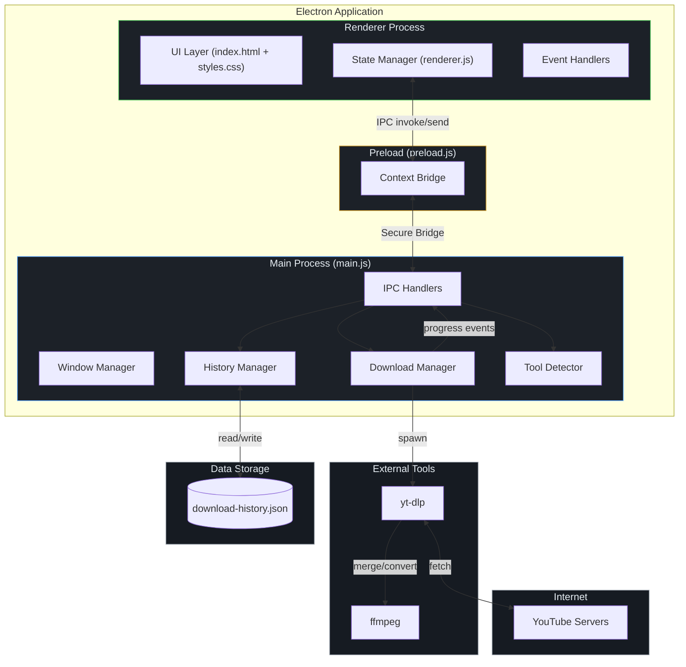
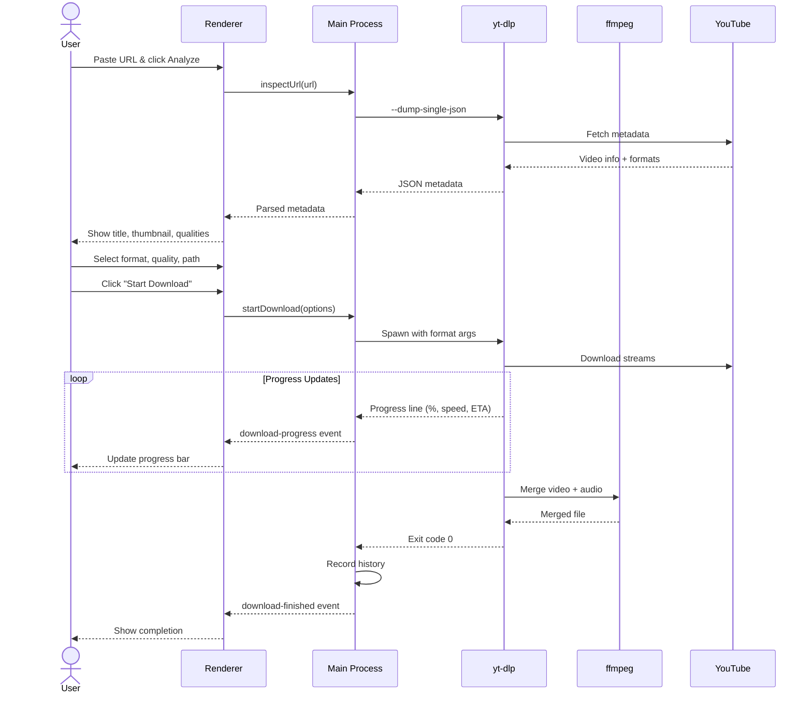
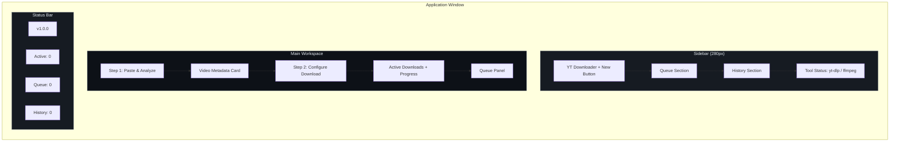
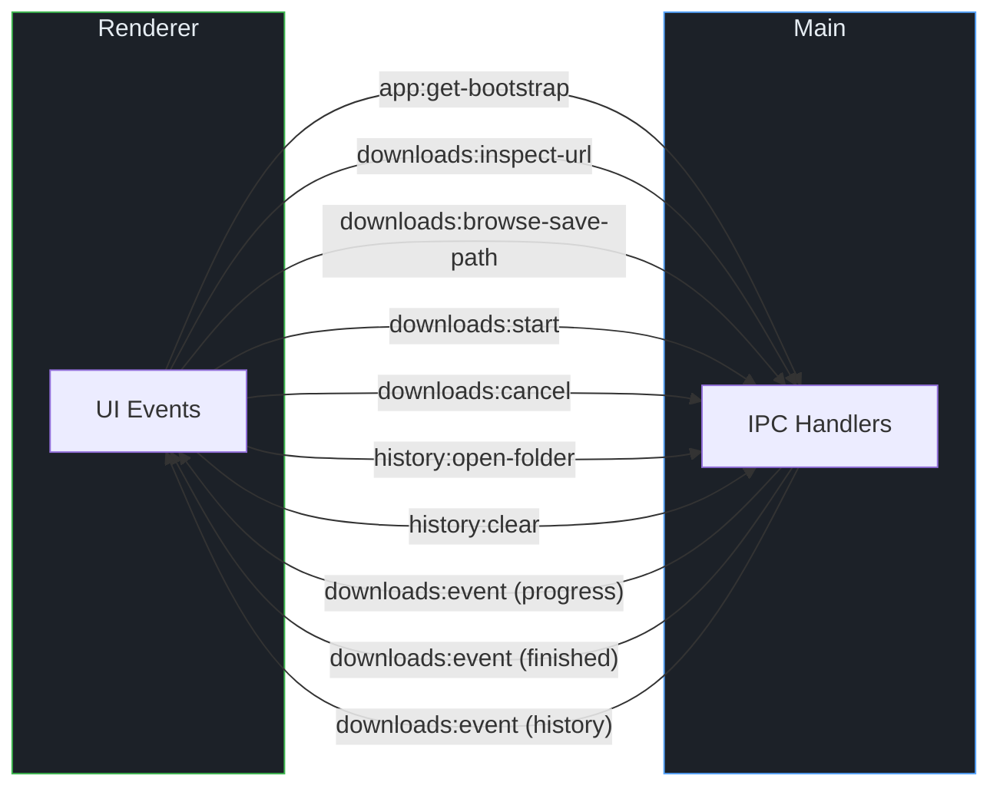

# YouTube Video Downloader

A modern, cross-platform desktop application for downloading YouTube videos and audio. Built with **Electron** and **yt-dlp**, featuring a clean dark UI with real-time progress tracking, download queue management, and persistent history.


---

## Features

- **Video Analysis** — Paste any YouTube URL and instantly inspect video metadata (title, channel, duration, thumbnail, available qualities)
- **Multiple Formats** — Download as MP4, WEBM (video) or MP3, WAV (audio)
- **Quality Selection** — Choose from all available resolutions and audio bitrates
- **Real-time Progress** — Live download speed, ETA, percentage, and file size updates
- **Download Queue** — Queue multiple downloads and start them all concurrently
- **Persistent History** — Track all completed, failed, and cancelled downloads across sessions
- **Custom Save Location** — Pick exactly where each file gets saved
- **Automation Support** — Automate downloads via environment variables for scripting and CI/CD
- **Dark UI** — Clean, modern dark interface designed for usability and focus

## Prerequisites

Before running the application, ensure these tools are installed and available in your system PATH:

| Tool        | Version | Purpose                | Install                                                            |
| ----------- | ------- | ---------------------- | ------------------------------------------------------------------ |
| **Node.js** | 20+     | Runtime                | [nodejs.org](https://nodejs.org)                                   |
| **yt-dlp**  | Latest  | Video extraction       | `brew install yt-dlp` / [GitHub](https://github.com/yt-dlp/yt-dlp) |
| **ffmpeg**  | Latest  | Audio/video processing | `brew install ffmpeg` / [ffmpeg.org](https://ffmpeg.org)           |

### Quick Install (macOS)

```bash
brew install yt-dlp ffmpeg
```

### Quick Install (Windows)

```bash
winget install yt-dlp.yt-dlp
winget install Gyan.FFmpeg
```

### Quick Install (Linux)

```bash
# Ubuntu/Debian
sudo apt install ffmpeg
pip install yt-dlp

# Arch
sudo pacman -S yt-dlp ffmpeg
```

## Installation

```bash
# Clone the repository
git clone https://github.com/rishat5081/youtube-video-downloader.git
cd youtube-video-downloader

# Install dependencies
npm install

# Start the application
npm start
```

## Usage

### Basic Workflow

1. **Paste URL** — Copy a YouTube video URL and paste it into the input field
2. **Analyze** — Click "Analyze" to fetch video metadata and available qualities
3. **Configure** — Select your preferred format (MP4/WEBM/MP3/WAV) and quality
4. **Choose Location** — Click "Browse" to select where to save the file
5. **Download** — Click "Start Download" or add to queue for batch downloading

### Queue Management

- **Add to Queue** — Configure a download and click "Add to Queue" instead of starting immediately
- **Start All** — Launch all queued downloads concurrently with the "Start All" button
- **Individual Control** — Start or remove individual items from the queue

### Automation

The app supports automated downloads via environment variables:

```bash
AUTO_URL="https://www.youtube.com/watch?v=..." \
AUTO_SAVE_PATH="/path/to/output.mp4" \
AUTO_FORMAT="mp4" \
AUTO_QUALITY="1080" \
AUTO_START="1" \
npm start
```

| Variable         | Description                                  | Default |
| ---------------- | -------------------------------------------- | ------- |
| `AUTO_URL`       | YouTube video URL                            | —       |
| `AUTO_SAVE_PATH` | Output file path                             | —       |
| `AUTO_FORMAT`    | Output format (`mp4`, `webm`, `mp3`, `wav`)  | `mp4`   |
| `AUTO_QUALITY`   | Quality (`best`, `1080`, `720`, `480`, etc.) | `best`  |
| `AUTO_START`     | Auto-start download (`1` = yes)              | `0`     |
| `AUTOMATION_LOG` | Log automation events to stdout (`1` = yes)  | `0`     |

## Architecture

```
youtube-video-downloader/
├── main.js              # Electron main process (IPC, download management, history)
├── preload.js           # Context bridge (secure IPC between main & renderer)
├── package.json         # Dependencies and scripts
├── src/
│   ├── index.html       # Application UI structure
│   ├── styles.css       # Dark theme styling
│   └── renderer.js      # Renderer process (UI logic, state management)
└── downloads/           # Default download directory
```

### Application Architecture Diagram



### Download Flow



### UI Layout



### Process Architecture

| Process      | File          | Responsibilities                                                      |
| ------------ | ------------- | --------------------------------------------------------------------- |
| **Main**     | `main.js`     | Window management, yt-dlp spawning, file dialogs, history persistence |
| **Preload**  | `preload.js`  | Secure IPC bridge via `contextBridge`                                 |
| **Renderer** | `renderer.js` | UI rendering, state management, user interaction handling             |

### IPC Communication



### Data Storage

- **Download History**: Stored as JSON in Electron's `userData` directory
  - macOS: `~/Library/Application Support/youtube-downloader-electron/download-history.json`
  - Windows: `%APPDATA%/youtube-downloader-electron/download-history.json`
  - Linux: `~/.config/youtube-downloader-electron/download-history.json`
- Maximum 200 history entries (oldest entries are automatically pruned)

## Tech Stack

| Technology                                 | Purpose                            |
| ------------------------------------------ | ---------------------------------- |
| [Electron](https://www.electronjs.org/)    | Cross-platform desktop framework   |
| [yt-dlp](https://github.com/yt-dlp/yt-dlp) | YouTube video/audio extraction     |
| [ffmpeg](https://ffmpeg.org/)              | Audio/video processing and merging |
| Node.js child_process                      | Process spawning for yt-dlp        |

## Security

- **Context Isolation**: Enabled — renderer cannot access Node.js APIs directly
- **Node Integration**: Disabled — all IPC goes through the preload bridge
- **XSS Protection**: All user-facing content is HTML-escaped
- **No Remote Content**: App loads only local files

## Scripts

```bash
npm start     # Launch the application
npm run dev   # Launch in development mode
npm run check # Syntax-check all JavaScript files
```

## Supported Formats

| Format | Type  | Description             |
| ------ | ----- | ----------------------- |
| MP4    | Video | H.264 video + AAC audio |
| WEBM   | Video | VP9 video + Opus audio  |
| MP3    | Audio | MPEG Layer 3 audio      |
| WAV    | Audio | Uncompressed PCM audio  |

## Troubleshooting

### yt-dlp not found

Ensure yt-dlp is in your PATH. Run `which yt-dlp` (macOS/Linux) or `where yt-dlp` (Windows) to verify.

### ffmpeg not found

Ensure ffmpeg is in your PATH. The app requires ffmpeg for video merging and audio conversion.

### Download fails with merge error

Update yt-dlp to the latest version: `yt-dlp -U` or `brew upgrade yt-dlp`

### Video quality not available

Some videos have limited format availability. Try selecting "Best available" quality.

## Contributing

1. Fork the repository
2. Create your feature branch (`git checkout -b feature/amazing-feature`)
3. Commit your changes (`git commit -m 'Add amazing feature'`)
4. Push to the branch (`git push origin feature/amazing-feature`)
5. Open a Pull Request

## License

This project is licensed under the MIT License. See the [LICENSE](LICENSE) file for details.

## Author

**Rishat** — [GitHub](https://github.com/rishat5081)

---

Built with Electron + yt-dlp
